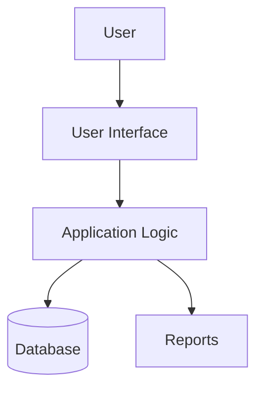

<div align="center">

# 📚 Library Management System

### 🏛️ Smart Digital Library Administration

*Manage books, members, issues, returns and fines from one simple, organised platform.*

<br>


<br>

[🔗 Repository](https://github.com/vishal945vr/YOUR_REPO) · [👤 Author](#-author)

</div>

---

> [!NOTE]
> Replace the `YOUR_...` placeholders (language, database, repository name) with your project's real details before publishing.

## 📋 At a Glance

| | |
| :--- | :--- |
| 🎯 **Purpose** | Replace manual library registers with a digital system |
| 👥 **Users** | Librarians, administrators and library members |
| 📖 **Core modules** | Books, members, issue and return, fines, reports |
| ⚡ **Benefit** | Faster lookups, fewer errors, clear records |

## 🔎 Project Overview

The Library Management System helps a library run its daily work digitally. It keeps a complete record of books and members, tracks every issue and return, calculates fines automatically, and gives the librarian quick answers about what is available and what is overdue.

It is designed for school, college and small community libraries that still depend on paper registers or spreadsheets.

## ❓ Problem Statement

Manual library management creates everyday problems:

- 🗂️ Book and member records are scattered across registers
- 🔍 Finding a book or checking availability takes time
- 📅 Overdue books and due dates are easy to forget
- 💸 Fines are calculated by hand and often wrong
- 📉 There is no quick view of library activity

## 💡 Solution

One system keeps every record connected and up to date.

```
👤 Member
 ↓
🔍 Search Book
 ↓
📖 Issue Book
 ↓
📅 Due Date Tracking
 ↓
↩️ Return Book
 ↓
💸 Fine Calculation
 ↓
📊 Reports
```

## ✨ Key Features

| | Feature | What it delivers |
| :---: | --- | --- |
| 📖 | **Book Management** | Add, update, delete and categorise books with stock counts |
| 👥 | **Member Management** | Register members and keep their borrowing history |
| 🔍 | **Smart Search** | Find books by title, author, category or ISBN |
| 📤 | **Issue and Return** | Issue books, record returns and update availability instantly |
| 📅 | **Due Date Tracking** | See what is issued, due soon and overdue |
| 💸 | **Fine Calculation** | Automatic fines for late returns |
| 🔐 | **Role-Based Access** | Separate admin, librarian and member views |
| 📊 | **Reports** | Issued books, overdue lists, popular titles and member activity |

## 🧭 User Journey

| Step | Action |
| :---: | --- |
| 1️⃣ | 🔐 Log in as admin, librarian or member |
| 2️⃣ | 🔍 Search the catalogue |
| 3️⃣ | 📖 Issue a book to a member |
| 4️⃣ | 📅 Track the due date |
| 5️⃣ | ↩️ Record the return |
| 6️⃣ | 💸 Collect any fine |
| 7️⃣ | 📊 Review reports |

## 🏗️ System Architecture



## 🗃️ Core Data

| Entity | Key information |
| --- | --- |
| 📖 Book | Title, author, category, ISBN, copies available |
| 👤 Member | Name, contact, membership date, status |
| 🔁 Transaction | Book, member, issue date, due date, return date |
| 💸 Fine | Amount, reason, payment status |

## 🧰 Technology Overview

| Category | Technology |
| --- | --- |
| 🐍 Language | YOUR_LANGUAGE |
| 🖥️ Interface | YOUR_FRAMEWORK |
| 🗄️ Database | YOUR_DATABASE |
| 🐳 Containerization | Docker (optional) |
| ⚙️ CI/CD | GitHub Actions (optional) |

## 📁 Project Structure

```
Library-Management-System/
├── main file        # 🚪 Application entry point
├── models/          # 🗃️ Book, member and transaction data
├── services/        # ⚙️ Issue, return and fine logic
├── ui/              # 🎨 Screens and forms
├── database/        # 🗄️ Schema and sample data
└── README.md
```

## ⚡ Getting Started

```bash
git clone https://github.com/vishal945vr/YOUR_REPO.git
cd YOUR_REPO
# install dependencies, then start the app
```

Add the exact install and run commands for your stack here.

## 📈 Future Scope

- [ ] 📧 Email or SMS reminders for due dates
- [ ] 📱 Mobile-friendly interface
- [ ] 🔖 Barcode or QR scanning for books
- [ ] 🛒 Book reservation and waiting list
- [ ] 📄 Export reports to PDF and Excel
- [ ] 🌐 Online catalogue for members

## 💼 Skills Demonstrated

| Area | Demonstrated through |
| --- | --- |
| 🧱 Application design | Modular structure with clear responsibilities |
| 🗄️ Database design | Related tables for books, members and transactions |
| 🔐 Access control | Role-based views |
| 📊 Reporting | Queries that turn records into insights |

## 👤 Author

**Vishal Rajput**
🎓 BCA Student

[](https://github.com/vishal945vr)

<div align="center">

⭐ If you find this project useful, consider giving it a star.

</div>
